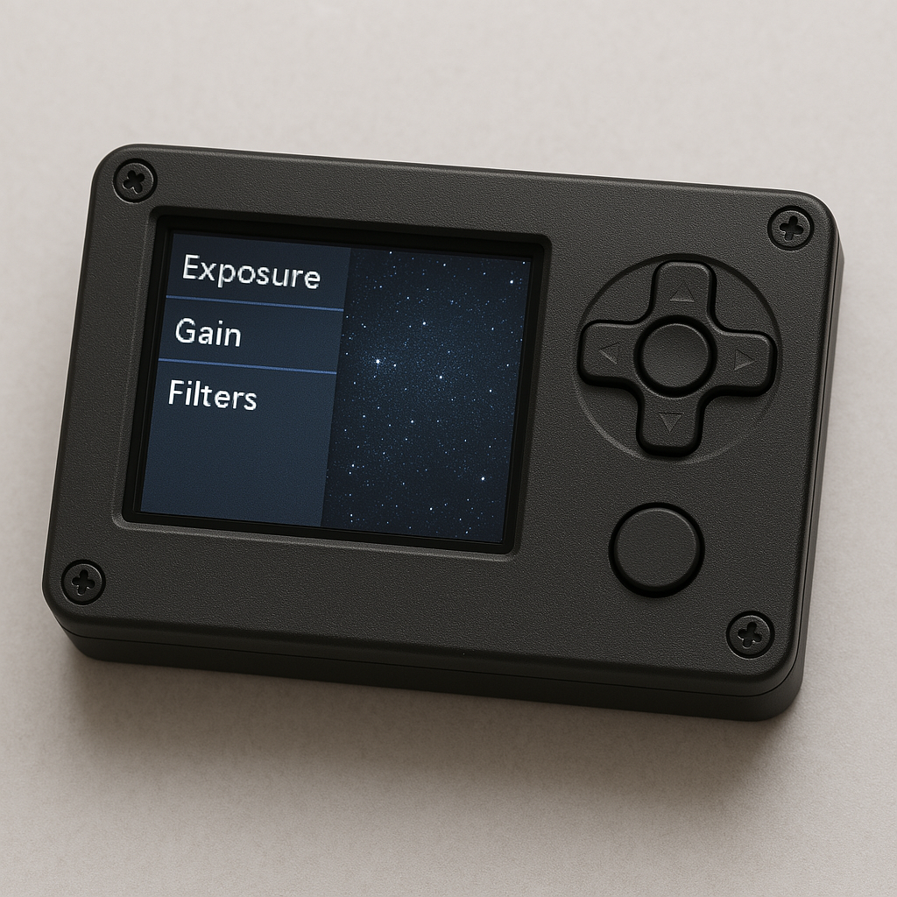

# Installation

Hopefully this will be one-click when I package it up as a `.deb` file.

# Dependencies

## Windows / Mac

This is only tested on a Linux Linux desktop and Raspberry pi but it should work cross platform if the Linux instructions are converted, e.g. homebrew instead of apt, and might require using `pip` directly for python dependencies.

## Linux

If you're on a desktop like Debian you may need to enable `non-free` or `contrib` to get access to ZWO libs, but these should be available on a standard raspberry pi by default:

```
sudo apt install libasi python3-pygame python3-box python3-fitsio udevil exfatprogs fonts-hack
```

On a raspberry pi we need to add legacy support for exfat (not necessary on the desktop)

```
sudo apt install exfat-fuse
sudo ln -s mount.exfat-fuse /usr/sbin/mount.exfat
```

And we need some python dependencies that are not packaged already for the Raspberry pi

```
python3 -m pip install --user --break-system-packages pygame_menu
```

To have permissions to format drives, you may need to have a suitable sudoer entry in `/etc/sudoers.d/` (this is not necessary on the raspberry pi)

```
echo "${USER} ALL=(ALL) NOPASSWD: /sbin/mkfs.*" | sudo tee /etc/sudoers.d/format > /dev/null
sudo chmod 0440 /etc/sudoers.d/format
```

Then install the source code itself

```
git clone git@github.com:fommil/luddcam.git
cd luddcam
```

# Running

## Developer / Desktop

It should "just work" if you run

```
python3 luddcam.py
```

## Auto Start (Raspberry Pi)

We'll define it as a user service and turn off the desktop.

```
sudo raspi-config

=> System Options
=> Boot / Auto Login
=> Console
```

Then check out this repo and install the required services:

```
mkdir -p ~/.config/systemd/user
ln -s $PWD/luddcam.service ~/.config/systemd/user/

sudo loginctl enable-linger $(whoami)
systemctl --user daemon-reload
systemctl --user enable luddcam.service
```

Then when you reboot, it should start up!

# Version 2

For version 2 we're going to go custom hardware for folk with a 3d printer. I want it to look even more like a DSLR. This is a mockup of how I imagine it might look (with buttons on the top for the menu and shutter):


