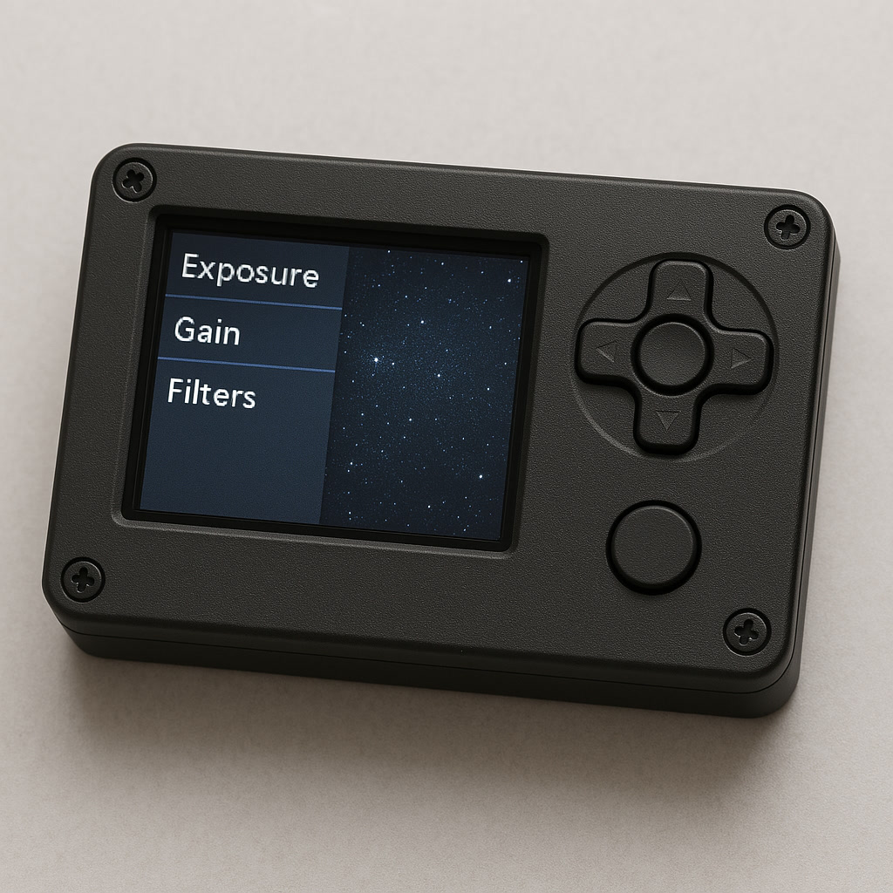

**LuddCam** is a minimalist astrophotography control system. Designed for a Raspberry Pi with an LCD screen and retro game controller, it brings the feel of a classic DSLR to your astrocamera. It can also be used as a plug-and-play guider.

Modern astrophotography software often tries to automate everything: target acquisition, autofocus, flat frames, guiding, meridian flips, live stacking... and before you know it, the telescope is doing all the work, and you're just a remote spectator from your living room. LuddCam goes the other way. It requires you to be physically present: polar aligning through a scope, focusing, framing your shot, checking your histograms, pressing the shutter, waiting patiently to see how it comes out. It's not about convenience, it's about connection.

LuddCam supports a few carefully chosen "cheat codes", like electronic filter wheels, guiding, and plate solving. But they are there as helpers, not crutches. Astrophotographers are encouraged to star hop to their targets (following printed star charts) instead of using go-to, use their mount's manual tracking or periodic error correction (PEC) whenever exposure and focal lengths allow it, and to manually change filters. The luddite way is to minimise the amount of technology used for any given picture, but the main objective is to be present, under the stars. LuddCam is open to integrating with any hardware, but draws the line at remote connections.

Whether you're a DIY tinker-photographer, an analog romantic, or just someone who enjoys feeling the click of a real button under a dark sky, LuddCam is for you.

# LuddScore

Sometimes we just want to take the best picture possible and that's not possible the Luddite way: more technology does demonstrably make things better (when it works!). To help even the field, try computing your Luddite Score, and use it as a way to avoid comparing yourself with unatainable god-like images on astrobin.

Start with a score of 10 and deduct a point for every one of the following that you use in a picture:

- any kind of wireless connection
- computer assisted polar alignment
- GOTO to find the target
- plate solving to find the target
- guiding with a guide camera
- automated flat panels
- automated rotation
- automated filter changes
- automated focus
- AI assisted post-processing

and be proud to share that score in your pictures, no matter what it is. There's really no wrong answer so long as you enjoy it!

# Hardware

Caveat: LuddCam currently only works with ZWO cameras and filter wheels, because that's all I have access to. If you really want something else you can try asking nicely but you will have to do some beta testing as I'm sure it won't work out first time.

It is possible to run LuddCam on a laptop, but that somewhat defeats the point. It is really designed to run on a Raspberry Pi. You can use a Model 4B or anything more recent.

Beyond the [Raspberry Pi 4B with 4GB+](https://thepihut.com/products/raspberry-pi-starter-kit?variant=20336446079038), I recommend the [WaveShare 4.3" LCD screen](https://thepihut.com/products/4-3-dsi-capacitive-touchscreen-display-for-raspberry-pi-800x480) ([the Amazon version includes a case](https://www.amazon.co.uk/dp/B09B29T8YF)) and [NES gamepad](https://thepihut.com/products/nes-style-raspberry-pi-compatible-usb-gamepad-controller). In total this should be just over $100. The screen / gamepad are optional if you only want to use it with a guide camera such as the ZWO ASI120 or ASI220.

I've found that after physically attaching the LCD screen the following entry in `/boot/firmware/config.txt` is all that is needed:

```
[all]
dtoverlay=vc4-kms-dsi-waveshare-panel,4_3_inch
```

# Installation

Installation is currently a bit tricky, but I'm working on making it a single click: follow the steps in `INSTALL.md`.

# Version 2

For version 2 we're going to go custom hardware for folk with a 3d printer. I want it to look even more like a DSLR. This is a mockup of how I imagine it might look (with buttons on the top for the menu and shutter):


